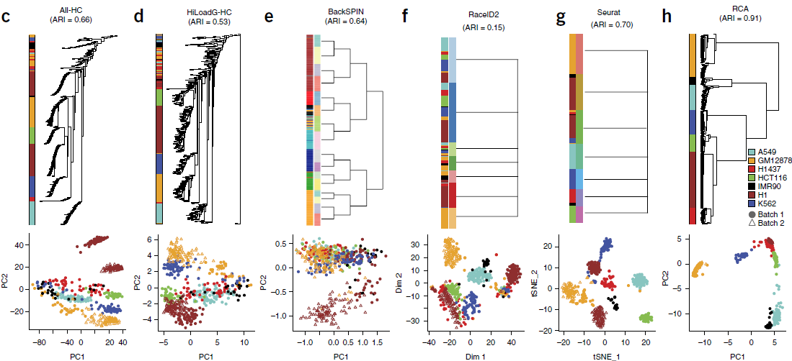

# Introduction
肿瘤内异质性是决定肿瘤生物学，治疗反应以及病人存活情况的一个关键性因素。因此，对肿瘤中出现的各种类型细胞的表型以及相互之间的联系进行一个全面的描述是很有
必要的。传统的针对 bulk-tissue 的分析会掩盖肿瘤内不同细胞群体的特征，因此有人通过一些 marker 来对细胞进行分类，但这种方法需要我们有足够的先验知识，并且
依赖特异性、高亲和力的抗体来实现对应细胞类型的分离纯化。随着单细胞测序技术的出现以及流行，我们能够对肿瘤中细胞多样性进行全面的，无偏好性的分析。不过，
在单细胞转录组领域，还是存在诸多因素导致难以准确区分不同类型的细胞。本文献中，作者提出了一种被称为 `reference component analysis (RCA)` 的聚类算法。  
结直肠癌 (colorectal cancer, CRC) 是全世界第三常见的肿瘤。本文献中，作者针对从11个原发结直肠癌及对应正常样本中分理处590个（经过质控）细胞进行 
scRNA-seq 分析，并利用 RCA 进行聚类。此外，作者对不同类型的细胞进行了表达特征的描述，利用他们对病人存活情况进行分层。  
  
# RCA与现有聚类方法的比较  
现有针对 scRNA-seq 数据进行聚类的方法的准确性没办法进行全面的量化，因为我们并不知道真实的细胞类型，一般只能通过某一类中的细胞表达了预期的细胞类型标记
做一个定性的验证。但是，这种基于 marker 的方法有时候可能会误导我们，因为 single-cell 测序往往难以发现那些表达量较低的基因，以及 marker 基因的异位表达
等情境也可能干扰我们的判定。  
为了对不同的聚类方法做一个比较，作者从7个细胞系中经质控挑出561个细胞的单细胞转录组数据。这些细胞有两个不同来源：GM12787(类淋巴母细胞)和H1胚胎干细胞，
可以评估批次效应带来的影响。利用现有的8大 scRNA-seq 聚类方法以及 RCA 对这些数据进行了分析。这些方法包括：  
* Reference component analysis (RCA)  
* hierarchical clustering using all expressed genes (All-HC)  
* hierarchical clustering using principal-component analysis (PCA)-based feature selection (HiLoadG-HC)  
* BackSPIN10  
* RaceID2  
* Seurat1  
* VarG-HC  
* VarG-PCAproj-HC  
* VarG-tSNEproj-HC  
  
其中后三种方法是基于那些表达差异特别大的基因进行聚类的。针对聚类的结果，利用 `adjusted Rand Index (ARI)` 进行量化：ARI 为0时，表示聚类是随机的；
为1时，表示结果完美。各方法的 ARI 结果如下图所示:  
  
从图中我们可以得出以下结论：  
1. 考虑到现有聚类方法的准确性有限，scRNA-seq 数据的系统性变异主要是由于技术误差而非生物学差异组成  
2. 每个细胞中发现的基因数量（number of detected gene, NODG）能够解释第一主成分中几乎所有的变异  
3. RCA 要明显优于其他现有的聚类方法  
